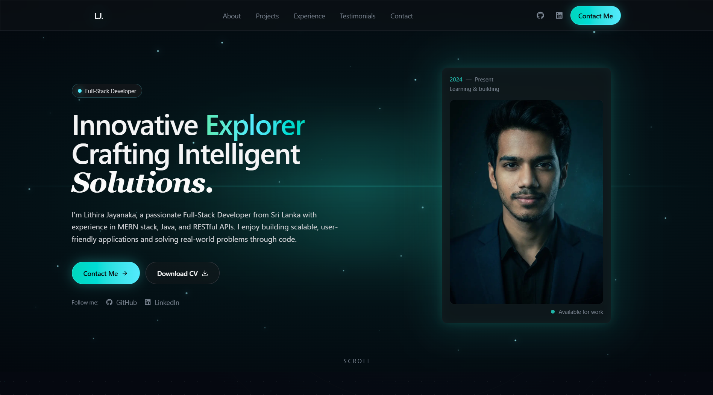

# Lithira Jayanaka Portfolio

<p align="center">
  <a href="https://nextjs.org/"></a>
  <a href="https://react.dev/"></a>
  <a href="https://www.typescriptlang.org/"></a>
  <a href="https://tailwindcss.com/"></a>
</p>

<p align="center">
  Modern developer portfolio focused on clean storytelling, strong performance, and production-level SEO.
</p>

---

## At A Glance

| Item | Details |
| --- | --- |
| Live Site | https://lithira-jayanaka.vercel.app |
| Purpose | Personal brand and project showcase |
| Architecture | Next.js App Router + modular component sections |
| Motion | GSAP + Framer Motion |
| Styling | Tailwind CSS 4 |
| Language | TypeScript |

## Visual Preview



## Product Focus

This portfolio is designed to do three things well:

1. Communicate technical depth quickly
2. Present projects in a recruiter/client-friendly format
3. Stay easy to maintain as your career grows

## What Is Included

| Area | Coverage |
| --- | --- |
| Branding | Hero, bio, role positioning |
| Credibility | Skills, experience, testimonials |
| Work Proof | Featured projects with links |
| Conversion | Contact section and social channels |
| SEO | Metadata, OG tags, Twitter tags, JSON-LD, robots, sitemap |

## Local Development

```bash
git clone <your-repository-url>
cd personal-portfolio
npm install
npm run dev
```

Open: http://localhost:3000

## Command Reference

| Command | Description |
| --- | --- |
| npm run dev | Run development server |
| npm run build | Build production bundle |
| npm run start | Start production server |
| npm run lint | Run ESLint checks |

## Folder Blueprint

```text
src/
  app/            # routing, layout, metadata, sitemap, robots
  components/     # sections, layout blocks, animations, reusable UI
  hooks/          # custom animation/scroll hooks
  lib/            # constants and utility helpers
public/
  images/         # profile and project visuals
  pdf/            # downloadable documents
```

## Editing Content Fast

Update core portfolio data in:

- src/lib/constants.ts

This controls personal info, skills, projects, education, leadership, references, and testimonials.

## SEO Implementation Map

| File | Responsibility |
| --- | --- |
| src/app/layout.tsx | global metadata, JSON-LD schema |
| src/app/page.tsx | page-level metadata |
| src/app/robots.ts | crawler directives |
| src/app/sitemap.ts | indexable route map |

## Deployment

Recommended: Vercel

1. Push repository to GitHub
2. Import project in Vercel
3. Deploy with default Next.js settings

The app is also compatible with other Node.js hosting providers that support Next.js builds.

## Contact

- Name: Lithira Jayanaka
- Email: lithira.jayanaka.official@gmail.com
- LinkedIn: https://www.linkedin.com/in/lithira-jayanaka
- GitHub: https://github.com/LithiraJK

## License

License is currently not specified in this repository.
If needed, add a LICENSE file (MIT is common for portfolio projects).
